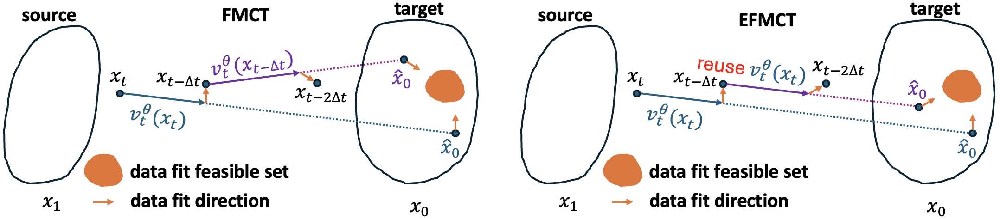

**Efficient Flow Matching for Sparse-View CT Reconstruction** (MICCAI 2026)

Jiayang Shi, Lincen Yang, Zhong Li, Tristan van Leeuwen, Daniel M. Pelt, K. Joost Batenburg

Generative models, particularly Diffusion Models (DM), have shown strong potential for Computed Tomography (CT) reconstruction serving as expressive priors for solving ill-posed inverse problems. However, diffusion-based reconstruction relies on Stochastic Differential Equations (SDEs) for forward diffusion and reverse denoising, where such stochasticity can interfere with repeated data consistency corrections in CT reconstruction. Since CT reconstruction is often time-critical in clinical and interventional scenarios, improving reconstruction efficiency is essential. In contrast, Flow Matching (FM) models sampling as a deterministic Ordinary Differential Equation (ODE), yielding smooth trajectories without stochastic noise injection. This deterministic formulation is naturally compatible with repeated data consistency operations. Furthermore, we observe that FM-predicted velocity fields exhibit strong correlations across adjacent steps. Motivated by this, we propose an FM-based CT reconstruction framework (FMCT) and an efficient variant (EFMCT) that reuses previously predicted velocity fields over consecutive steps to substantially reduce the number of Neural network Function Evaluations (NFEs), thereby improving inference efficiency. We provide theoretical analysis showing that the error introduced by velocity reuse is bounded when combined with data consistency operations. Extensive experiments demonstrate that FMCT/EFMCT achieve competitive reconstruction quality while significantly improving computational efficiency compared with diffusion-based methods.



## Table of Contents
- [Table of Contents](#table-of-contents)
- [Environment Requirements](#environment-requirements)
- [Datasets](#datasets)
- [Pretrained Flow Matching Models](#pretrained-flow-matching-models)
- [CT Reconstruction](#ct-reconstruction)
  - [FMCT (no velocity reuse)](#fmct-no-velocity-reuse)
  - [EFMCT (velocity reuse)](#efmct-velocity-reuse)
  - [Diffusion-Based Baselines](#diffusion-based-baselines)
- [Training Flow Matching from Scratch](#training-flow-matching-from-scratch)

## Environment Requirements
- At least one Nvidia GPU for training/inference.
- Main dependencies are `pytorch, diffusers, astra-toolbox, tifffile`.

We provide the conda [configuration](environment.yml) to create the same environment for the benchmark.

Create and activate the main Conda environment:

```bash
conda env create -f environment.yml
conda activate efmct
```

## Datasets
- The low dose challenge dataset: [Low Dose Grand Challenge](https://www.aapm.org/grandchallenge/lowdosect/) 
- The decathlon segmentation challenge dataset: [Decathlon](http://medicaldecathlon.com)

A single example image from the Low Dose dataset is included in [here](lodochallenge/L506_000.tif) for quick testing. 

## Pretrained Flow Matching Models
| Dataset | Pretrained model |
|---------|---------------------------|
| Low dose challenge | [Flow Matching](https://drive.google.com/drive/folders/1TQEEpSZY4oEeWFMckBhi4kDgdz9wpWcH?usp=share_link) |
| Decathlon | [Flow Matching](https://drive.google.com/drive/folders/1GRqf-a3qHX1wPrtOwRd3WCILsIvx5wim?usp=share_link) |


## CT Reconstruction
Reconstruction using pretrained models can be executed with [flow_recon.py](flow_recon.py). Both FMCT and EFMCT are implemented in the same script. 

### FMCT (no velocity reuse)
| Parameter | Value |
| --------- | ----- |
| num_inference_steps | 50 |
| skip_after | 50 |
| max_skips_in_a_row| any |
| eta | any |

### EFMCT (velocity reuse)
| Parameter | Value |
| --------- | ----- |
| num_inference_steps | 50 |
| skip_after | 0 |
| max_skips_in_a_row| 10 |
| eta | 1.05 |

### Diffusion-Based Baselines
For diffusion-based comparison methods, please refer to the [DM4CT Benchmark](https://github.com/DM4CT/DM4CT) repository for implementation details.

## Training Flow Matching from Scratch
Training a flow matching model from scratch can be performed using [train_flow.py](train_flow.py).